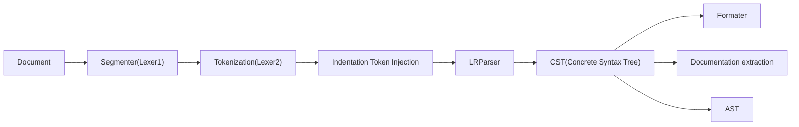

# Lexer/Parser/Formatter/Documentation generator.

The general structure of the code would be as follows: 



We want to write the code in a modular way so that other people can replace the
parts of the chain with improved version.

We also want to focus on user experience, this means that the compiler design 
must help to produce a `code formatter`, a `Documentation generator`, and a
`LSP`. Yes, this is ambitious, but I think that those are core tools in
modern languages together with `package manager` (and we also aim to support
at the compiler level the idea of a `package`).


## Error recovery approach.

The language is indentation based, this means that we may found miss-indented
code like 

```haskell
f n = 
case n of 
 ...
```

We want to discover as many errors as possible while parsing, for this
we introduce a recovery strategy as follows:

- The only valid things at indentation 0 are :
    + Keywords at module declaration (`module`, `data`, `class`, ...)
    + Comment blocks `{-+.*-+}`
    + Line comments 
    + Variable declaration
    + Variable definition
    + Operator declaration
    + Operator definition 
- We would split the file in segments and pass to the lexer2/parser only one 
  segment at a time. 
- At lexer2 if we find an unexpected character, we skip the rest of the segment
    and emit a `UnexpectedCharacter` token.
- At token injection we add corresponding indentation tokens, in case of 
    error we would emit a `IndentationError` or subclass of them and 
    stop processing the segment.
- The parser wouldn't distinguish between an unexpected regular token and 
    an error token, it would fail if it found any of those, but we would 
    handle our unexpected tokens in a special way.

## Formatter

The formatter needs a full tree representing the code, the only thing we don't
preserve are spaces (note that we forbid tabs in source files).

We follow the approach that every token has associate the comments directly 
above them and the line comment immediately after it. For this reason
we banned `Block comments` to appear at an indentation different from 0,
so we don't have to handle code like:

```haskell
f n = some function {-- coment here --} other args
```

instead it should be written like:

```haskell
f n = some function -- coment here
    other args
```

Or variants of it.

We don't admit those kinds of comments as them increase the time of 
search for an optimal representation of the formatted code.

Additionally, the formatter should comply with other properties.

### Respect any line break

Sometimes users use line break in code with intention, maybe they
want to signal a grouping of code, or maybe they are formatting code
to follow a particular visual pattern like in:

```haskell
tik_tak_toe_state = [
    O, X, O,
    O, X, O,
    X, O, X
    ]
```

We don't want the code formatter to collapse things like that to one line!

### A second pass of parser
If we parse the formatted code we must produce the same CST except for the 
position attached to every node.

### Very opinionated
This would guarantee code consistency across modules.

## Documentation generator

The documentation generator would need communication of the results of the 
type checker.


## Indentation approach.

Disclaimer: This would my 6th attempt at it, past two times I did it right but
was limited, this time I want to do it better.


As in Haskell and Purescript, there are some special tokens that make us 
change our lexer state, we are going to follow a reformulation of the 
Purescript approach, but we won't aim to allow keywords in the expressions.

Purescript has the concept of a `Context` and a `Stack of Context`, 
we would replace the explicit stack with the `calling stack` of python
and the current `Context` would be those of the current function in 
execution.

This means that we want to have functions like: 


```python
def let_context(text:Iterable[Token],let_token:Token,last_indentation_level:IndentationLevel)->Iterable[Token]: 
    pass

def case_context(text:Iterable[Token],case_token:Token,last_level:IndentationLevel)->Iterable[Token]: 
    pass
```

And a main function:

```python
def token_injection(text:Token,last_level:IndentationLevel)->Iterable[Token]:
```

This function would be used inside the other ones to handle the internal the `UnNeeded` tokens.
